  

# 🎬 Awesome Media Asset Management (MAM) & DAM Software 📁

  
  
  
  
  

A curated, SEO-optimized list of top **Media Asset Management (MAM)**, **Digital Asset Management (DAM)** platforms, cloud video collaboration software, and high-performance open-source alternatives for creative professionals, video editors, broadcasting studios, and enterprise media teams. 🚀

---

## 💡 Overview & Market Landscape 📈

> **🌐 Market Size & Industry Dynamics:**
> The global **Media Asset Management (MAM)** market is estimated at **$5.2 Billion (2026)** and is projected to reach **$11.8 Billion by 2031** (growing at a CAGR of ~17.8%). 
> The sector is **moderately fragmented**, featuring high-profile enterprise acquisitions (such as Adobe acquiring Frame.io for $1.275B) alongside established broadcast giants (Dalet, EditShare) and specialized SaaS innovators (Iconik, Axle AI).

---

## ☁️ Enterprise SaaS & Hosted Platforms 🏢

Below is a comparative matrix of leading hosted Media Asset Management (MAM) platforms, sorted by estimated company valuation / revenue (descending).

| 🏢 Platform | 💰 Company Scale (Valuation / Revenue) | 💵 Starting Tier Pricing | 🆓 Free Tier Limit / Free Trial | 🌟 Key Features & Workflow Strengths |
| :--- | :--- | :--- | :--- | :--- |
| **[Frame.io](https://frame.io)** | **$1.275 Billion Valuation** *(Acquired by Adobe)* | **$15 / member / month** (Pro Plan) | **Free Forever Plan** (2 Users, 2 Projects, 2GB active storage) | Native Adobe Creative Cloud integration, Camera-to-Cloud (C2C), real-time video review & approval. |
| **[Dalet Flex](https://www.dalet.com/tools/flex/)** | **~$67.7 Million** Annual Revenue | **$1,500 / month** (Base Enterprise Platform) | **14-Day Free Trial** (Guided sandbox test with workflow demo) | Enterprise-grade broadcast workflow orchestration, multi-platform publishing, automated metadata ingestion. |
| **[MediaValet](https://www.mediavalet.com/)** | **~$13.7 Million** Annual Revenue | **$850 / month** (Starting Business Tier) | **30-Day Free Sandbox** (Full platform access upon request) | Built on Microsoft Azure, unlimited users model, AI auto-tagging, strict SOC 2 compliance. |
| **[Axle AI](https://axle.ai/)** | **~$9 Million Valuation** (~$6.2M Revenue) | **$20 / TB / month** (Cloud) or **$2,995** (On-Premise perpetual) | **14-Day Free Trial** (Axledit web browser video editor & MAM trial) | AI-powered facial recognition & speech-to-text, lightweight browser MAM for Premiere/Final Cut. |
| **[Evolphin Zoom](https://www.evolphin.com/)** | **~$5.0 Million** Annual Revenue | **$35 / user / month** (Standard Cloud) | **14-Day Free Trial** (Full workflow testing environment) | High-speed deduplication, visual version control, deep NLE panel integration for 4K/8K video timelines. |
| **[Iconik](https://www.iconik.io/)** | **~$1.3 Million** ARR | **$65 / user / month** (Standard User) / **$9/mo** (Browse User) | **30-Day Free Trial** (Includes 100 free processing credits) | Hybrid cloud/on-prem asset indexing, pay-as-you-go active user billing, auto-proxy generation. |
| **[EditShare Flow](https://www.editshare.com/products/flow-media-management/)** | Privately Held (*Mid-Market Leader*) | **$29 / user / month** (Flow Lite SaaS tier) | **14-Day Free Trial** (Available via sales workflow specialist) | Remote media production indexing, automated backup/archiving to LTO/S3, fast proxy video editing. |
| **[Cantemo Portal](https://www.cantemo.com/)** | Privately Held (*Part of Codemill*) | **$45 / user / month** (Base Cloud Tier) | **30-Day Free Demo Trial** (Sandbox environment setup) | Modular REST API architecture, customizable matrix permissions, native final-cut & Avid integration. |
| **[Square Box CatDV](https://www.quantum.com/en/products/software/catdv/)** | Privately Held (*Acquired by Quantum*) | **$450 / user** (Perpetual Desktop License) | **30-Day Free Trial** (Full desktop client & server evaluation) | Heavyweight video ingestion, clip logging, legacy automation scripts, SAN/NAS shared storage indexing. |

---

## 🔓 Open-Source MAM & DAM Solutions 🛠️

Self-hosted and open-source media asset management software ranked by GitHub community stargazers (descending).

| 📦 Repository & Project | ⭐ GitHub Stars_Count | 📜 License | 🛠️ Tech Stack | 🎯 Core Focus & Description |
| :--- | :--- | :--- | :--- | :--- |
| **[Immich](https://immich.app)** |  | AGPL-3.0 | TypeScript, Dart, Svelte | High-performance self-hosted photo & video management solution with facial recognition, mobile backup, and vector search. |
| **[PhotoPrism](https://photoprism.app)** |  | AGPL-3.0 | Go, Vue.js, TensorFlow | AI-powered photo and video asset management powered by Go and TensorFlow. Deep facial indexing and automated classification. |
| **[Pimcore](https://pimcore.com)** |  | GPL-3.0 | PHP, Symfony, MySQL | Enterprise-grade digital asset management (DAM), PIM, MDM, and CMS. Handles millions of digital assets with complex metadata workflows. |
| **[Sveltia CMS](https://github.com/sveltia/sveltia-cms)** |  | MIT | Svelte, JavaScript | Lightweight Git-based headless content and media manager, ideal for static media repositories and fast asset publishing. |
| **[Manyfold](https://manyfold.app)** |  | MIT | Ruby on Rails, Three.js | Specialized self-hosted digital asset manager for 3D models, mesh files, and spatial media assets. |
| **[Phraseanet](https://www.phraseanet.com)** |  | GPL-3.0 | PHP, Symfony, Elasticsearch | Professional open-source Digital Asset Management solution used by museums, publishers, and media agencies. |
| **[AtroDAM](https://atrodam.com)** |  | GPL-3.0 | PHP, Backbone.js, MySQL | Modern open-source DAM built on AtroCore. Features flexible entity mapping, REST API, and media workflow automation. |
| **[Freeframe](https://github.com/Techiebutler/freeframe)** |  | MIT | Next.js, Node.js | Open-source alternative to Frame.io designed for video review, timestamped annotations, and client feedback collaboration. |
| **[AWS Visual Asset Management System (VAMS)](https://github.com/awslabs/visual-asset-management-system)** |  | Apache-2.0 | AWS CDK, Python, React | AWS-native architecture for managing, converting, and serving 3D visual assets, AR/VR media, and high-res video assets. |
| **[ResourceSpace](https://www.resourcespace.com)** |  | BSD-3-Clause | PHP, MySQL | Established open-source DAM system designed for non-profits, enterprise media libraries, and educational institutions. |

---

## 🤝 Contributing & Support 💖

Contributions are welcome! If you know of an awesome MAM platform, DAM repo, or media workflow tool that should be listed here, feel free to open a Pull Request.

### 💖 Support the Project
If you find this curated list helpful, please consider:
- 🌟 **Starring** this repository on GitHub.
- 🔀 **Forking** it to add your own media workflow tools.
- 📢 **Sharing** it with fellow video engineers, editors, and media architects.

---

## 📈 Star History

---

## 📄 License ⚖️

Distributed under the MIT License. See `LICENSE` for more information.
